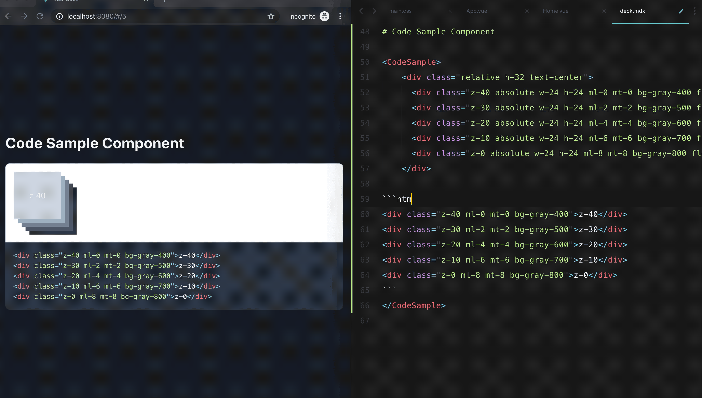

# VUE MDX Deck

## Project setup
```
yarn install
```

### Compiles and hot-reloads for development
```
yarn run serve
```

### Compiles and minifies for production
```
yarn run build
```


## Getting Started



Modify an [MDX][] file in `src/mdx/deck.mdx` and separate each slide with `---`.

````mdx
# This is the title of my deck

---

# About Me

---

```jsx
<CodeSnippet />
```

---

import HelloWold from './components/HelloWold'

## <HelloWold />

# The end
````


## Keyboard Shortcuts

| Key         | Description                                  |
| ----------- | -------------------------------------------- |
| Left Arrow  | Go to previous slide                         |
| Right Arrow | Go to next slide                             |
| Option + O  | Toggle [Overview Mode](#overview-mode)       |


[mdx]: https://mdxjs.com/
